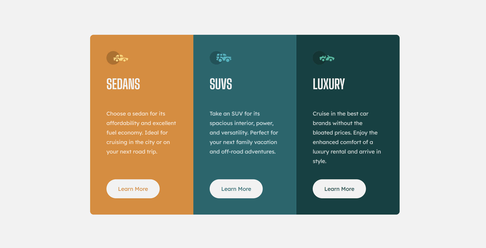

# 📇 Cards Dashboard UI

A simple, responsive Cards Dashboard built using **HTML** and **CSS**. This project includes modern UI elements, and interactive icons for a clean and functional user interface.

---

## 🖼️ Screenshot



---

## 📁 Project Structure
```
cards-dashboard/
│
├── index.html              ← Your main HTML file
├── style.css               ← CSS for styling the dashboard
├── /images
└── README.md               ← Project description


```
---

## ✨ Features

- Responsive card layout
- Hover effects for interactivity
- Font Awesome icons
- Clean and modern design
- Minimal and semantic HTML

---

## 🚀 Getting Started

To run this project locally:

1. Clone or download the repository.
2. Open the `index.html` file in your browser.


